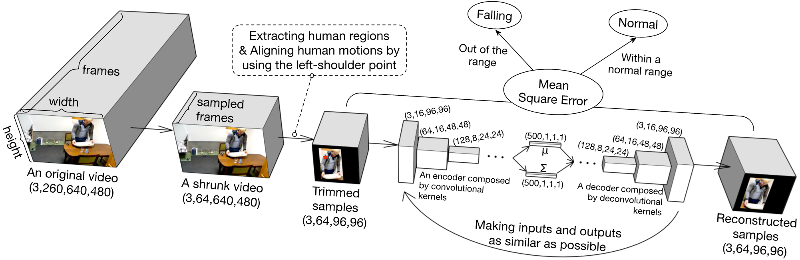
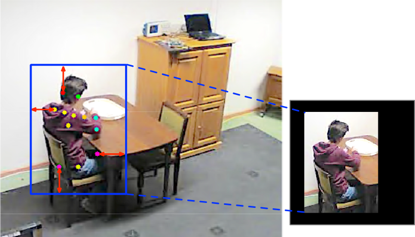
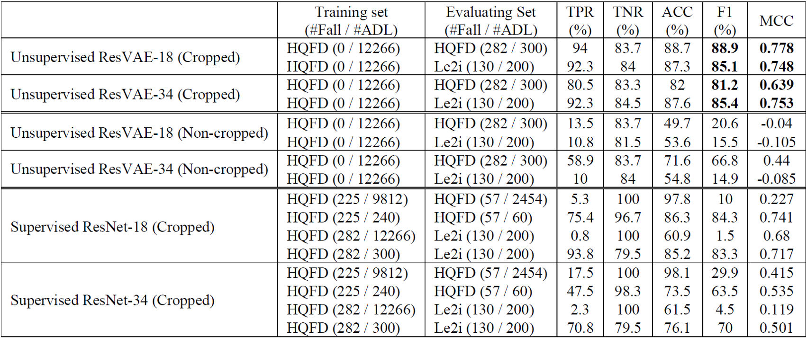

# Recognizing Fall Actions from Videos using Reconstruction Error of Variational Auto-encoder 

## Motivation
* Demands of stable fall-detecting systems are increasing. 
* The performance of supervised learning networks depends on abundant well-labeled data, but fall action data is scarce and lacks labels.
* We would like to take good use of abundant Activity of Daily Life (ADL) data by using an unsupervised learning method. 

## Classification using the reconstruction error of VAE
* We propose a network for learning a distribution of ADL data using a variational auto-encoder (VAE) with 3D-convolutional residual blocks.

* After training is finished, most reconstruction errors of ADL samples are limited within a certain range. In contrast, the reconstruction errors of abnormal samples should be greater than that range. 
* We assume that an unknown sample is classified as falling if its normalized reconstructed error is larger than a threshold.

## Region extraction for focusing on learning human motions
* Since the ratio of the human region to the entire image is too low, the neural networks cannot sufficiently learn motion information. 
* Thus, we decided to extract the human region from an entire image so that the neural network can focus on learning human motion, not the background.

## Experimental results
* Unsupervised ResVAEs with cropped data had better performance than standard ResNets with cropped data, which showed ResVAEs can overcome imbalance of ADL data and fall action data.

* By applying region extraction technique, ResVAEs with cropped data can focus on learning motion information and obtained better performance than those without cropped data. 

